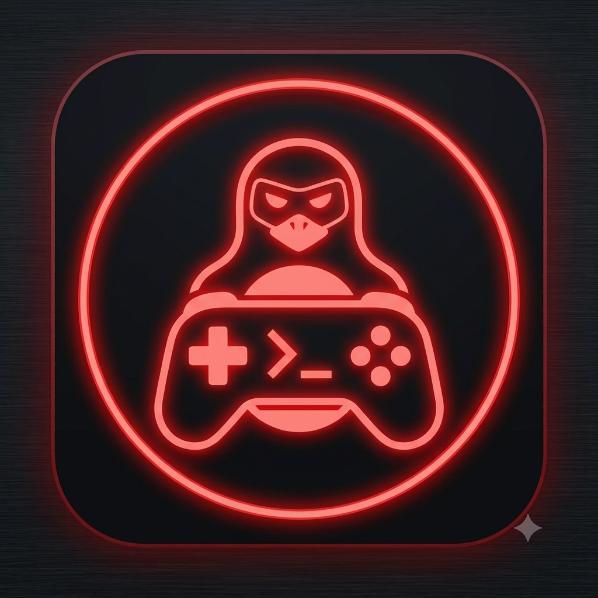
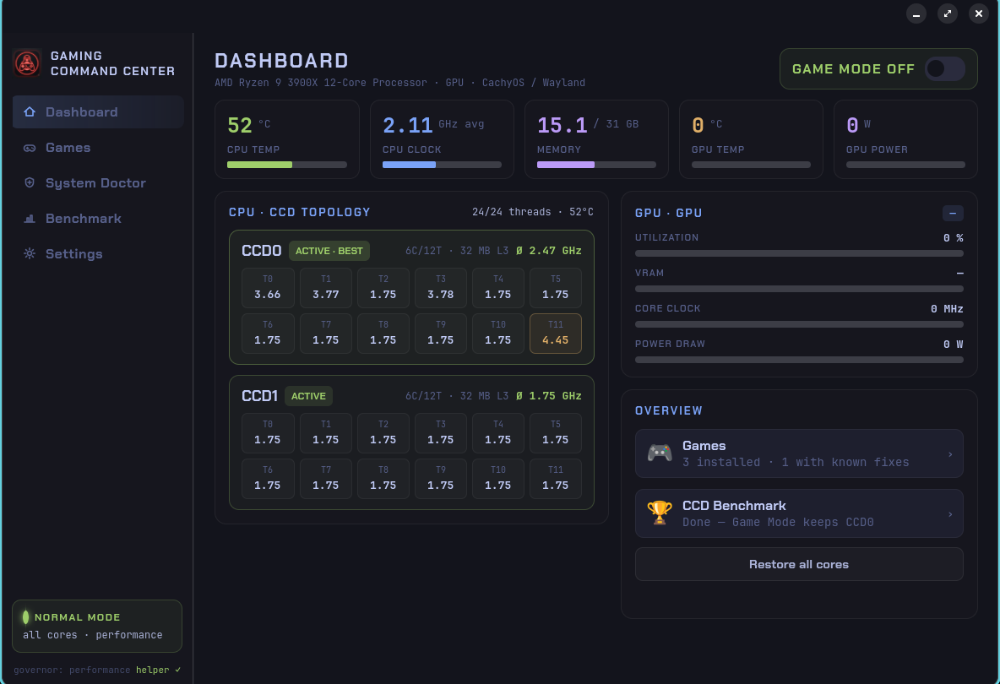
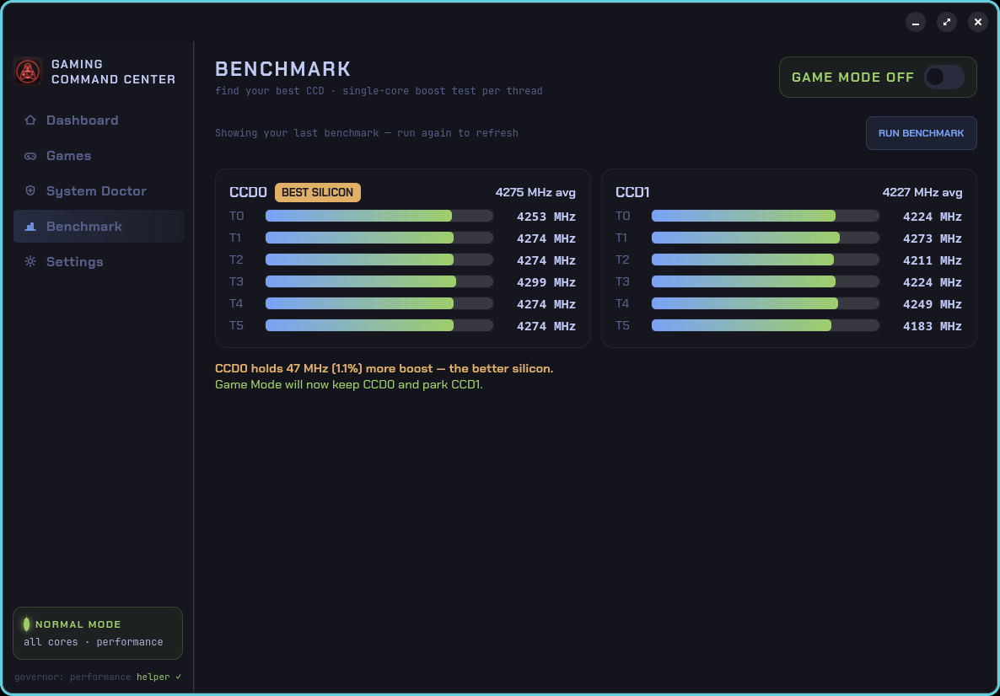
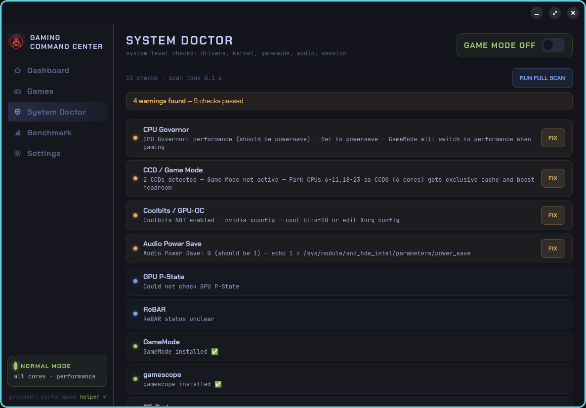
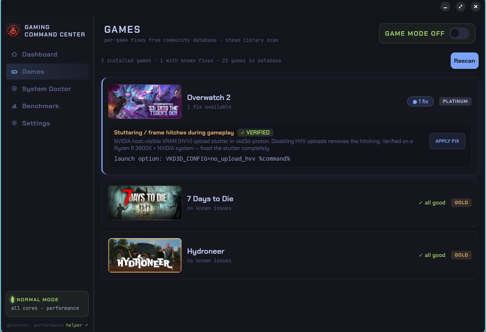

<div align="center">



# Gaming Command Center 🎮🐧

**Stop hunting forums for hours. Tune, fix and monitor your Linux gaming rig from one app.**

CPU core management · GPU monitoring · guided troubleshooting · one-click per-game fixes — native on Linux.

[](#roadmap)
[](LICENSE)
[](#supported-systems)
[](#tech)
[](https://lordhayne.github.io/gcc-landingpage/)



</div>

---

## Why this exists

Linux gaming is growing fast (Steam Deck, Proton, Wayland) — but when something breaks, you're on your own, digging through Reddit, GitHub issues and ProtonDB for hours. Every existing tool solves one slice:

| Tool | What it does | What it's missing |
|------|--------------|-------------------|
| **Ryzen Master** | CPU tuning | Windows-only |
| **Ryzen Master Commander** | Fan / TDP control | No CCD parking, no Game Mode, no GPU |
| **CoreCtrl** | AMD GPU profiles | No CPU CCD management |
| **ProtonDB** | Per-game fixes | It's a website, not built into your system |

**Gaming Command Center is the missing piece** — a *guided assistant* that combines CPU + GPU + troubleshooting in one native app, and actually applies the fix for you instead of just describing it. Think AMD Ryzen Master × GeForce Experience × ProtonDB, on Linux.

## Features

### 🎮 CPU — Core Management
- **Auto-detects CCD/CCX topology** — no hardcoded core numbers (AMD Ryzen with 2+ CCDs)
- **Game Mode** — park the weaker CCD with one click, like Ryzen Master's Game Mode
- **CCD Benchmark** — tests each CCD to find the better silicon (silicon lottery), then marks the winner
- **Live monitoring** — per-core frequency, online/offline status, temperature
- **Governor + EPP control** — `powersave` at idle, `performance` for gaming
- **No password needed** — runtime `sysfs` changes ship with a polkit policy

> On single-CCD or Intel CPUs, Game Mode is hidden and the rest of the app works normally.

<div align="center">
  
</div>

### 📡 GPU — Live Monitoring
- Core clock, memory clock, power draw, temperature, VRAM usage and P-state at a glance
- Works on any GPU for monitoring; NVIDIA gets the full metric set via `nvidia-smi`

### 🩺 System Doctor — Guided Troubleshooting
- **System scan** — 15+ checks for common Linux gaming issues
- **Apply-Fix buttons** — one-click fixes for governor, audio power-save, SATA, modprobe, ReBAR and more
- Covers NVIDIA and AMD GPUs, any CPU, Wayland and X11

<div align="center">
  
</div>

### 📋 Games — Per-Game Fixes
- **Detects your Steam games** and matches them against a community fix database ([`games.yaml`](games.yaml))
- **One-click apply** — sets Steam launch options automatically (backs up your config, refuses while Steam is running)
- **Only shows relevant issues** for your setup (GPU vendor + Wayland/X11)
- **ProtonDB tier** shown per game for context
- **Safe by design** — the database can only carry whitelisted fix types (`info`, `launch_option`, `file`, `tool_action`) — never arbitrary shell commands

<div align="center">
  
</div>

## Install

**One line — recommended:**

```bash
curl -fsSL https://raw.githubusercontent.com/LordHayne/GCC/main/bootstrap.sh | bash
```

It clones the repo into `~/.local/share/gaming-command-center` and runs the installer, which detects your distro, installs the GUI dependencies it needs (asking once before it touches anything), sets up the launcher, icon and permissions, and **verifies the app can actually start before it says "done"**. Then launch **Gaming Command Center** from your app menu.

Piping a script into your shell is worth a glance first — it's short and does nothing but clone and call `./install.sh`. Prefer to do it by hand?

```bash
git clone https://github.com/LordHayne/GCC.git
cd GCC
./install.sh
```

Run without installing (needs the GUI deps already present):

```bash
python3 command-center.py
```

## Supported systems

The installer auto-installs dependencies on the three main distro families and their derivatives:

| Family | Package manager | Covers (non-exhaustive) |
|--------|-----------------|--------------------------|
| **Arch** | `pacman` | Arch, CachyOS, Manjaro, EndeavourOS, Garuda, Artix |
| **Debian** | `apt` | Debian, Ubuntu, Linux Mint, Pop!\_OS, elementary, Kali |
| **Fedora** | `dnf` | Fedora, Nobara, RHEL, CentOS, Rocky, AlmaLinux |

On any other distro the app still runs — the installer just prints the exact packages to install by hand (PyGObject, GTK4, libadwaita, PyYAML) instead of doing it for you.

### Requirements

The installer handles the first two automatically; the rest are feature-specific.

- **Python 3 + PyGObject (GTK4 + libadwaita)** — the app itself *(installed for you)*
- **PyYAML** — for the per-game fix database *(installed for you)*
- `sensors` (lm_sensors) — CPU temperature
- `nvidia-smi` — GPU monitoring (NVIDIA)
- `pkexec` (polkit) — the one-time `/etc` setup fixes
- AMD Ryzen CPU with 2+ CCDs — for Game Mode / CCD parking

## Permissions

Gaming Command Center asks for root in two clearly separated ways, so the thing you do constantly does not cost you a password:

| What | Needs a password? | Why |
|------|-------------------|-----|
| Game Mode, governor, audio/SATA power saving | **No** | Runtime `sysfs` changes. A reboot undoes all of them, and you toggle Game Mode every time you play. |
| NVIDIA modprobe config | **Yes, once** | Writes NVIDIA module options to `/etc/modprobe.d`, which survive a reboot, so it stays behind admin authentication. |

The `/etc` fixes are one-time setup steps, and both back up any file they touch before merging their setting into it — your existing NVIDIA options are kept.

## Roadmap

**CPU**
- ✅ AMD Ryzen (3900X, 5900X, 7900X, 7950X3D, …)
- 🔜 Intel P-core/E-core management (hybrid architecture)

**GPU**
- ✅ Live monitoring (NVIDIA full set via `nvidia-smi`)
- 🔜 AMD GPU monitoring via `amdgpu` sysfs
- 🔜 Intel Arc monitoring

**Games / System Doctor**
- ✅ System-level checks and fixes
- ✅ Per-game database with auto-set Steam launch options
- 🔜 More verified fixes (contribute via PR — see below)
- 🔜 "Worked / Didn't work" community verification per fix
- 🔜 Optional auto-update of the database from GitHub

**Packaging**
- ✅ One-line installer + graphical first-run setup (no terminal after clone)
- 🔜 AppImage — true zero-prerequisite double-click
- 🔜 AUR package
- 🔜 Flatpak (if the sysfs/pkexec sandbox story works out)

## Contributing game fixes

The whole point is that nobody should have to dig through Reddit and ProtonDB for two hours again. Found a fix that works? Add it so the next person gets it with one click.

1. Open [`games.yaml`](games.yaml) — it's commented, with a template at the bottom.
2. Add your game (the `steam_id` is the number in its Steam store URL) and the issue + fix.
3. Open a pull request.

Fixes can be one of four types: `info` (show text), `launch_option` (set a Steam launch option), `file` (write a config file in the user's home), or `tool_action` (trigger a built-in like Game Mode). **Arbitrary shell commands are intentionally not supported** — the loader drops anything else, so a bad PR can't turn the database into an attack vector. If a fix genuinely needs a command, add it as `info` so the user reads and runs it themselves.

## Tech

Python + GTK4 + libadwaita, with a dark **Tokyo Night** theme (Chakra Petch / JetBrains Mono). Works on any Wayland or X11 desktop with GTK4 — COSMIC, GNOME, KDE and friends.

## License

[GPL-3.0-or-later](LICENSE). Forks and redistributions must stay open source, which is the norm for Linux system tools and keeps the game-fix database community-owned.

## Acknowledgements

- [GameMode](https://github.com/FeralInteractive/gamemode) by Feral Interactive
- [Ryzen Master Commander](https://github.com/sam1am/Ryzen-Master-Commander) for inspiration
- All the Linux gaming community pushing Proton + Wayland forward
